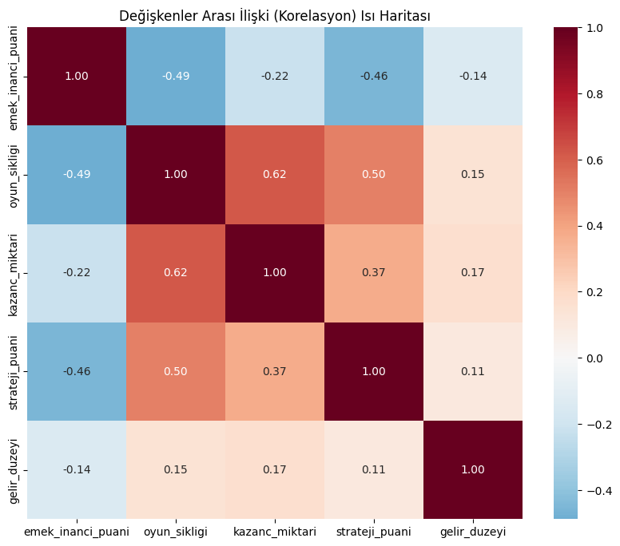
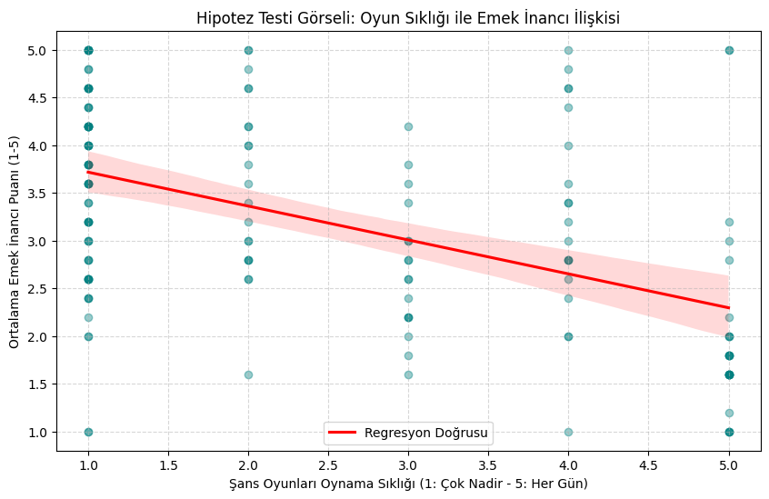

# Hızlı Kazanç Algısı ve Emek İlişkisi: İstatistiksel Bir Analiz ve Modelleme

Şans oyunlarına yönelik "hızlı kazanç" algısı ile emeğe duyulan inanç arasındaki ilişkiyi inceleyen anket temelli bir araştırma. 153 katılımcıdan toplanan veri üzerinde tanımlayıcı istatistiklerden aracılık ve moderasyon analizine uzanan bir modelleme süreci yürütülmüştür.

**Ders:** YÖBİ4801 Özel Konular — Veri Bilimine Giriş
**Danışman:** Dr. Habibe Aktay
**Ekip:** Tolga Olguner, Oğulcan Kacar, Bekir Kadir Demiraslan, Faruk Kılıç
**Durum:** Tamamlandı ve teslim edildi.

Bu bir dönem projesidir; rapor ve analiz yukarıdaki ekip tarafından hazırlanmıştır.

## Araştırma Modeli

| Rol | Değişken |
|---|---|
| Bağımlı (Y) | Emek inancı puanı — 5 maddelik Likert ölçeği ortalaması |
| Bağımsız (X) | Oyun oynama sıklığı, kazanç miktarı, strateji/beceri algısı |
| Aracı (M) | Strateji ve beceri algısı |
| Düzenleyici (W) | Gelir düzeyi, cinsiyet |
| Kontrol | Yaş, gelir düzeyi, cinsiyet |

## Bulgular

Aşağıdaki değerler `analiz/sans-oyunlari-analizi.ipynb` içindeki kayıtlı çıktılardan alınmıştır (N = 153).

**Ölçek güvenirliği (Cronbach's α)**

| Ölçek | α |
|---|---|
| Emek İnancı (5 madde) | 0.836 |
| Strateji Algısı (3 madde) | 0.760 |

**Korelasyonlar (emek inancı ile)**

| Değişken | r | p |
|---|---|---|
| Oyun oynama sıklığı | −0.488 | < 0.0001 |
| Strateji algısı | −0.457 | < 0.0001 |
| Kazanç miktarı | −0.218 | 0.0068 |



**Çoklu doğrusal regresyon** — R² = 0.330, Düzeltilmiş R² = 0.303, F(6, 146) = 11.99, p < 0.001

Modelin en güçlü yordayıcısı oyun oynama sıklığı: katılım sıklığı arttıkça emek inancı puanı düşüyor.



**Hipotez sonuçları**

| No | Hipotez | Etki | p | Karar |
|---|---|---|---|---|
| H1 | Oyun sıklığı → Emek inancı | β = −0.303 | < 0.001 | Desteklendi |
| H2 | Kazanç miktarı → Emek inancı | β = 0.128 | 0.064 | Desteklenmedi |
| H3 | Strateji algısı → Emek inancı | β = −0.292 | < 0.001 | Desteklendi |
| H4 | Strateji algısının aracı rolü | Dolaylı etki = −0.104 | %95 GA [−0.181, −0.046] | Desteklendi |
| H5a | Gelir düzeyinin düzenleyici rolü | β = −0.100 | 0.013 | Desteklendi |
| H5b | Cinsiyetin düzenleyici rolü | β = −0.143 | 0.242 | Desteklenmedi |

Kısaca: şans oyunlarını daha sık oynayanların ve kazanmayı kendi stratejisine bağlayanların emek inancı anlamlı biçimde daha düşük. Strateji algısı, oyun sıklığı ile emek inancı arasındaki ilişkide kısmi aracı rol üstleniyor. Kazanç miktarının tek başına anlamlı bir etkisi bulunamadı.

> Not: H4 satırı özet tabloya sonradan eklenmiştir; değeri 11. bölümdeki aracılık analizi çıktısından hesaplanır. Bu satırın yer aldığı 13. hücrenin çıktısı yerel bir çalıştırmadan (Python 3.12) gelir, diğer hücrelerin çıktıları teslim edildiği hâliyle durmaktadır. Defter yerelde baştan sona çalıştırılarak tüm sayıların özgün çıktılarla birebir aynı olduğu doğrulanmıştır.

## Analiz Akışı

`analiz/sans-oyunlari-analizi.ipynb` şu sırayla ilerler:

1. Veri hazırlığı ve ön işleme — kategorik yanıtların sayısallaştırılması
2. Değişken skorlarının oluşturulması ve güvenirlik analizi (ters kodlama, Cronbach α)
3. Veri kalitesi ve varsayım kontrolleri — eksik veri, çarpıklık, basıklık
4. Tanımlayıcı istatistikler — demografi ve oyun türü tercihleri
5. Ölçek ortalamaları ve merkezi eğilim analizi
6. Normallik testleri — Shapiro-Wilk
7. Karşılaştırmalı analizler — cinsiyete göre bağımsız örneklem t-testi
8. Korelasyon analizi ve ısı haritası
9. Çoklu doğrusal regresyon (OLS)
10. Modelin görselleştirilmesi
11. Aracılık (mediation) analizi
12. Moderasyon analizi — gelir düzeyi ve cinsiyet
13. Hipotez testleri özet tablosu

## Örneklem

153 katılımcı. Cinsiyet dağılımı %77.1 erkek (118), %22.9 kadın (35). En sık tercih edilen oyun türleri: spor bahisleri (%36.6), online casino (%35.3), yeni nesil hızlı oyunlar (%16.3), klasik şans oyunları (%11.8).

Veri Microsoft Forms üzerinden anonim olarak toplanmıştır; `Email` alanı tüm kayıtlarda `anonymous`, `Name` alanı boştur. Veri setinde katılımcıyı tanımlayan hiçbir bilgi yoktur.

## Depo Yapısı

```
analiz/
  sans-oyunlari-analizi.ipynb   Tüm analizi içeren Jupyter defteri (28 hücre, çıktılarıyla)
veri/
  sans-oyunlari.csv             Notebook'un okuduğu veri dosyası (153 kayıt)
  anket-ham-veri.xlsx           Ham anket export'u (aynı veri, Excel biçiminde)
belgeler/
  arastirma-raporu.pdf          Nihai rapor — 44 sayfa: literatür, yöntem, bulgular, anket formu
  arastirma-onerisi.md          Araştırma önerisi — konu, model ve toplanacak veriler
gorseller/
  korelasyon-isi-haritasi.png   Notebook çıktısından alınan grafikler
  regresyon-oyun-sikligi.png
requirements.txt
```

`sans-oyunlari.csv`, xlsx export'unun virgülle ayrılmış karşılığıdır; ikisi de aynı 153 kaydı içerir.

## Kullanılan Kütüphaneler

`pandas` · `numpy` · `scipy` · `statsmodels` · `pingouin` · `matplotlib` · `seaborn`

## Çalıştırma

Notebook Google Colab'da geliştirilmiştir; ilk hücre `pingouin` paketini kendisi kurar. Yerelde çalıştırmak için:

```bash
pip install -r requirements.txt
```

```bash
jupyter notebook analiz/sans-oyunlari-analizi.ipynb
```

Notebook veriyi `../veri/sans-oyunlari.csv` yolundan okur; defteri kendi klasöründen açtığınızda hücreler baştan sona sırayla çalıştırılabilir.
